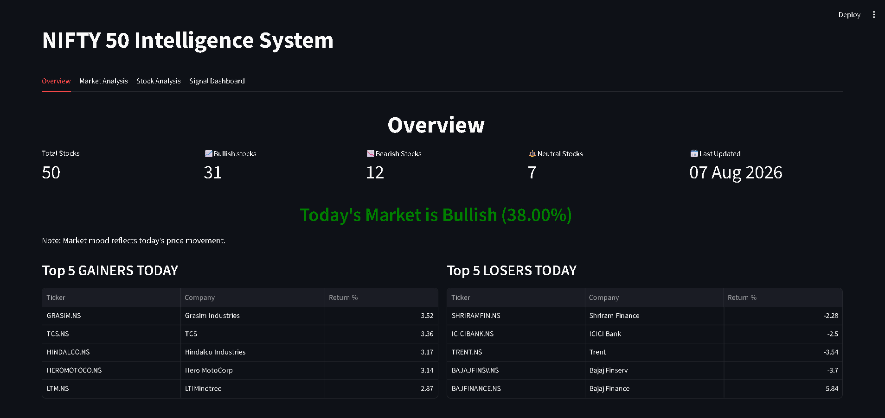
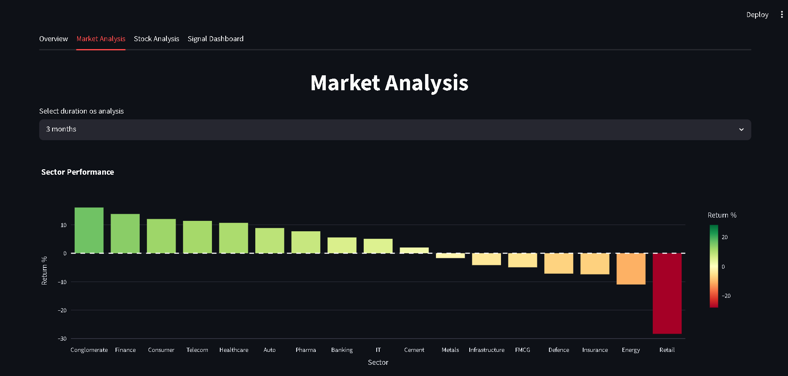
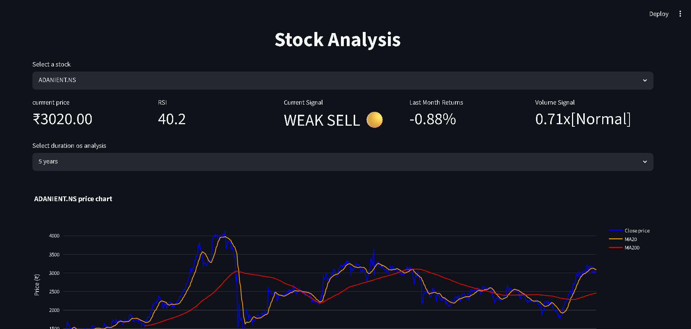
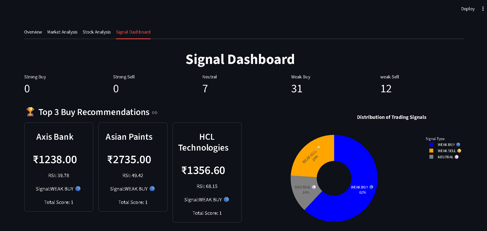
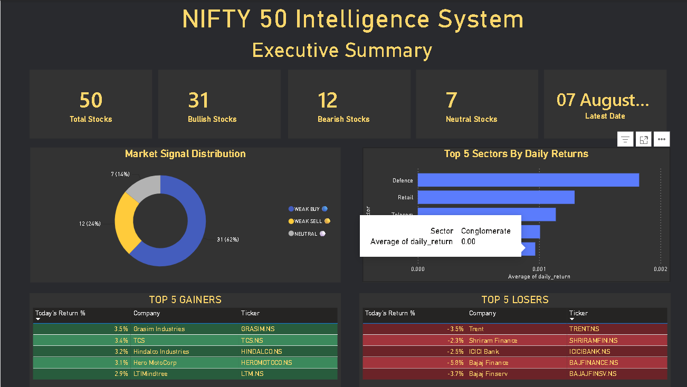
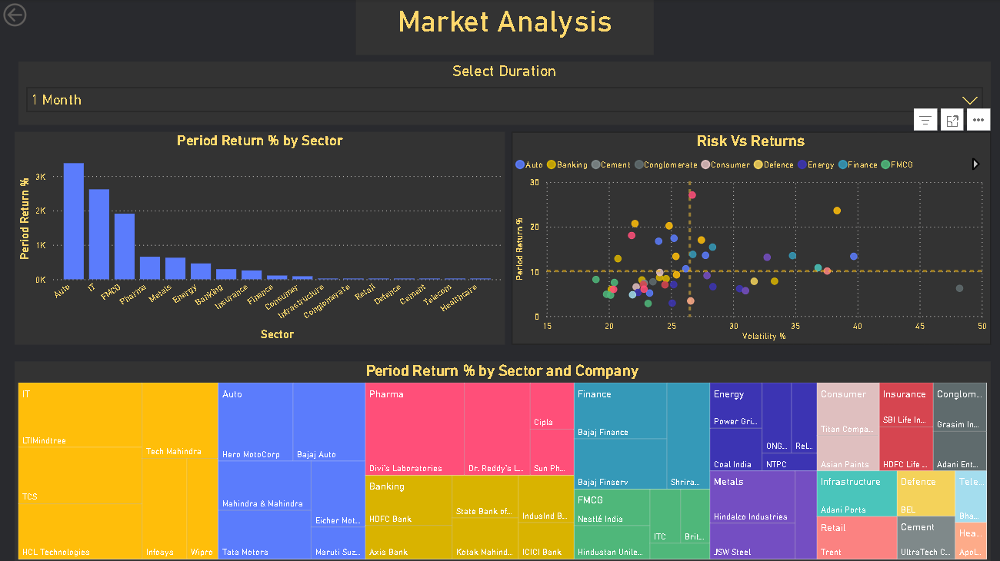
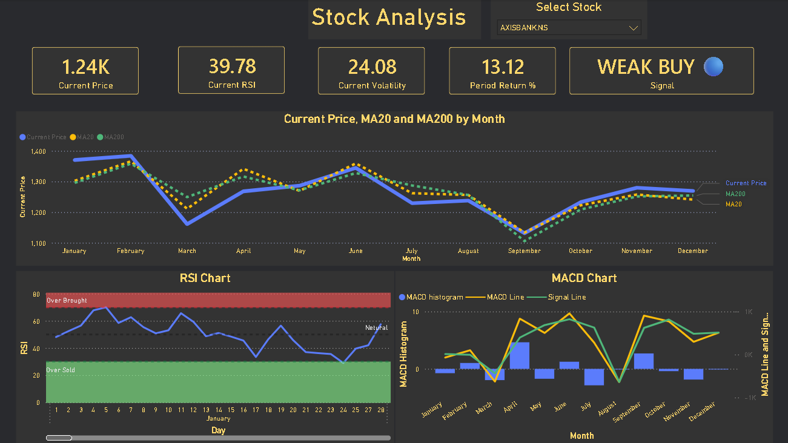
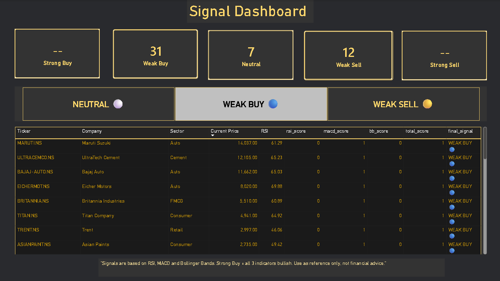

# 📈 NIFTY 50 Market Intelligence System


> An end-to-end stock market analytics platform tracking 50 NSE listed 
> stocks with technical indicators, signal scoring system and 
> interactive dashboards — built entirely from scratch.

**🔗 Live Streamlit Dashboard:** [Click Here](your-streamlit-link)  
# 📈 NIFTY 50 Market Intelligence System


> An end-to-end stock market analytics platform tracking 50 NSE listed 
> stocks with technical indicators, signal scoring system and 
> interactive dashboards — built entirely from scratch.

**🔗 Live Streamlit Dashboard:** [Click Here](your-streamlit-link)    
**💻 GitHub Repository:** [Click Here](your-github-link)

---

## 📌 What Is This?

The NIFTY 50 Market Intelligence System is a complete data analytics 
product that helps investors understand market conditions through 
data-driven insights.

This project covers the **complete end-to-end data analytics pipeline:**

---

## 📌 What Is This?

The NIFTY 50 Market Intelligence System is a complete data analytics 
product that helps investors understand market conditions through 
data-driven insights.

This project covers the **complete end-to-end data analytics pipeline:**

Data Collection → Cleaning → EDA → Technical Analysis
↓
Signal Generation → Streamlit Dashboard → Power BI Dashboard
↓
Automated Daily Update Pipeline

---

## 🖥️ Dashboard Screenshots

### Streamlit Dashboard

#### Overview Tab


#### Market Analysis Tab  
(screenshots/streamlit_market2.png)

#### Stock Analysis Tab
(screenshots/streamlit_stock2.png)

#### Signal Dashboard Tab


---

### Power BI Dashboard

#### Executive Summary


#### Market Analysis


#### Stock Analysis


#### Signal Dashboard


---

## ✨ Features

### 🏠 Market Overview
- Real-time market sentiment score
- Bullish / Bearish / Neutral stock count
- Top 5 gainers and losers of the day
- Market mood indicator with percentage

### 📊 Market Analysis
- Sector performance comparison
- NIFTY 50 interactive heatmap (treemap)
- Risk vs Return scatter plot (colored by sector)
- Stock correlation heatmap
- Duration filter: 1 Week → 5 Years

### 🔍 Stock Analysis
- Individual stock deep dive for all 50 stocks
- Price chart with MA20 and MA200 overlaid
- RSI chart with overbought/oversold zones
- MACD chart with histogram
- Volatility and Sharpe Ratio metrics
- Plain English signal explanation

### 🎯 Signal Dashboard
- Buy/Sell/Hold signals for all 50 stocks
- Top 3 buy recommendations with reasoning
- Signal distribution visualization
- Filter by signal type
- Color coded table

---

## 🛠️ Technical Indicators (Built From Scratch)

| Indicator | Period | What It Measures |
|-----------|--------|-----------------|
| RSI | 14 days | Overbought / Oversold conditions |
| MACD | 12, 26, 9 days | Momentum direction and strength |
| Bollinger Bands | 20 days | Price extremes and volatility |

### Signal Scoring System

RSI < 30 → +1 (oversold = buy opportunity)
RSI > 70 → -1 (overbought = sell signal)

MACD histogram positive → +1 (bullish momentum)
MACD histogram negative → -1 (bearish momentum)

Price below lower BB → +1 (statistically undervalued)
Price above upper BB → -1 (statistically overvalued)

─────────────────────────────────
Total Score │ Signal
─────────────────────────────────
+2 or +3 │ STRONG BUY 🟢
+1 │ WEAK BUY 🔵
0 │ NEUTRAL ⚪
-1 │ WEAK SELL 🟡
-2 or -3 │ STRONG SELL 🔴
─────────────────────────────────
---

## 💻 Tech Stack

| Layer | Technology | Purpose |
|-------|-----------|---------|
| Language | Python 3.10 | Core programming |
| Data Collection | yfinance | NSE stock data |
| Data Processing | Pandas, NumPy | Data manipulation |
| Visualization | Plotly | Interactive charts |
| Web Dashboard | Streamlit | Live web application |
| BI Dashboard | Power BI + DAX | Business intelligence |
| Automation | GitHub Actions | Daily data updates |
| Deployment | Streamlit Cloud | Cloud hosting |
| Version Control | Git + GitHub | Code management |

---

## 📁 Project Structure

nifty50-intelligence-system/
│
├── app.py ← Streamlit dashboard (4 tabs)
├── update_data.py ← Daily auto update script
├── indicator_generation.py ← RSI, MACD, BB calculation
├── requirements.txt ← Python dependencies
├── README.md ← Project documentation
│
├── data/
│ └── processed/
│       ├── cleaned_data.csv ← 5 years OHLCV + indicators
│       ├── final_df.csv ← Full indicators dataset
│       └── current_signal.csv ← Latest signals (50 stocks)
│  └── raw/
│       ├── ADANIENT.NS.csv
│       ├── ADANIPORTS.NS.csv
│       ├── APOLLOHOSP.NS.csv
│       ├── ...
│       └── 50 stock CSV files
├── notebooks/
│ ├── 01_data_collection.ipynb
│ ├── 02_data_cleaning.ipynb
│ ├── 03_eda.ipynb
│ └── 04_technical_indicators.ipynb
│
├── powerbi/
│ └── NIFTY50_Dashboard.pbix ← Power BI dashboard file
│
├── screenshots/
│ ├── streamlit_overview.png
│ ├── streamlit_market1.png
│ ├── streamlit_market2.png
│ ├── streamlit_stock1.png
│ ├── streamlit_stock2.png
│ ├── streamlit_signal.png
│ ├── powerbi_page1.png
│ ├── powerbi_page2.png
│ ├── powerbi_page3.png
│ └── powerbi_page4.png
│
└── .github/
      └── workflows/
      └── update.yml ← GitHub Actions automation
  
---

## 🔄 Data Pipeline

Every weekday at 6:00 PM IST (automated via GitHub Actions):

Step 1 → yfinance downloads latest market data
for all 50 NIFTY stocks

Step 2 → new data appended to cleaned_data.csv
daily returns recalculated

Step 3 → RSI calculated for all 50 stocks
(14-day exponential moving average)

Step 4 → MACD calculated (12, 26, 9 day EMA)
histogram = MACD line - Signal line

Step 5 → Bollinger Bands calculated (20-day)
upper = middle + 2σ
lower = middle - 2σ

Step 6 → Signal scores calculated using numpy
combined into final BUY/SELL/HOLD signal

Step 7 → final_df.csv and current_signal.csv updated

Step 8 → Streamlit Cloud auto-deploys fresh data
Power BI refreshes from updated files

---

## 🔍 Key Findings (5 Year Analysis 2021–2026)

| Metric | Finding |
|--------|---------|
| Best Performing Stock | BEL → **+759% return** |
| Worst Performing Stock | TRENT → **-31.8%** (recent correction) |
| Best Performing Sector | Defence & Telecom |
| Worst Performing Sector | IT (TCS -14%, Wipro -17%) |
| Most Volatile Stock | ADANIENT (49% annual volatility) |
| Least Volatile Stock | NESTLEIND (19% annual volatility) |
| Market Peak | 2024 – 2025 |
| Biggest Market Event | 2023 Hindenburg report crash |

---

## 🚀 How To Run Locally

### Prerequisites
```bash
Python 3.8+
pip
```

### Installation

```bash
# 1. Clone the repository
git clone https://github.com/yourusername/nifty50-intelligence-system
cd nifty50-intelligence-system

# 2. Install dependencies
pip install -r requirements.txt

# 3. Run the Streamlit dashboard
streamlit run app.py

# Browser opens automatically at http://localhost:8501
```

### To Update Data Manually
```bash
python update_data.py
```

---

## 📦 Requirements
streamlit
pandas
numpy
plotly
yfinance
streamlit-autorefresh

---

## 🤖 Automation (GitHub Actions)

The project uses GitHub Actions to automatically update data every weekday:

```yaml
Schedule: Every weekday at 6:00 PM IST
Process:
  1. Download latest market data
  2. Recalculate all indicators
  3. Update signal scores
  4. Commit updated CSVs to repository
  5. Streamlit Cloud auto-deploys
```

---

## ⚠️ Disclaimer

> This dashboard is built for **educational and portfolio purposes only**.  
> It is **not financial advice**.  
> Technical indicators are tools to assist analysis,  
> not guarantees of future performance.  
> Always do your own research before making investment decisions.

---

## 👤 About

**Built by Shobana**  
B.Tech CSBS | 3rd Year  

This project was built to learn end-to-end data analytics 
while exploring Indian stock market analysis from scratch.
Starting from zero stock market knowledge, this project 
covers the complete analytics pipeline from data collection 
to deployed interactive dashboards.

### 🔗 Connect With Me
- 💼 **LinkedIn:** [your linkedin link]
- 💻 **GitHub:** [your github link]
- 📧 **Email:** [your email]

---

